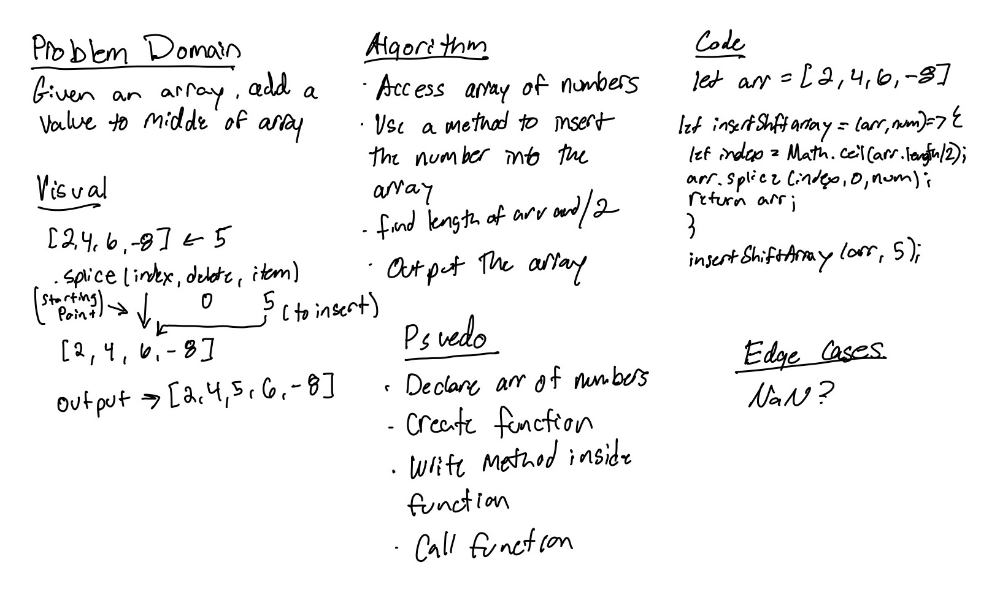

# Insert to Middle of an Array

> Write a function called insertShiftArray which takes in an array and a value to be added. Without utilizing any of the built-in methods available to your language, return an array with the new value added at the middle index.

## Whiteboard Process
<!-- >  -->

> 

## Approach & Efficiency
> I first had to research on ways to approach this and I found that the .splice() method seem to be the most east to explain. `	.splice()` takes in a `(start, delete, item)`. The start would be what index position you want the item to go into. The delete has to be 0 if you want to keep the rest of the items. The item is the item you would want to insert at that ‘start/index’. Also to insert in a middle of array, I had to create a variable to find the length of the array and divide it by two. I also had use `Math.ceil()` to round up the index number since there can be uneven numbers.
