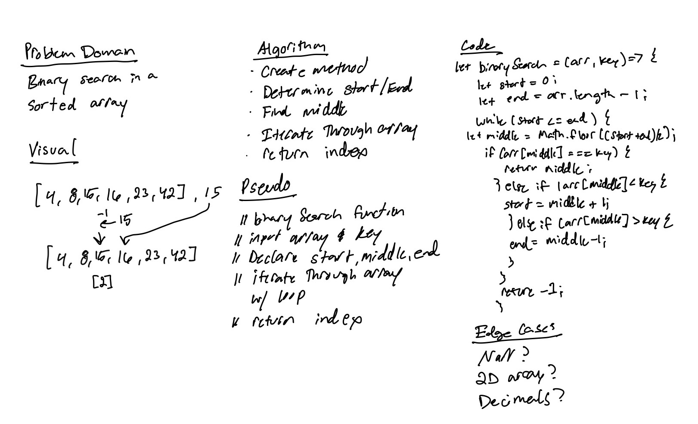

# Binary Search of Sorted Array

> Write a function called `BinarySearch` which takes in 2 parameters: a sorted array and the search key. Without utilizing any of the built-in methods available to your language, return the index of the array’s element that is equal to the value of the search key, or -1 if the element is not in the array.

## Whiteboard Process
> 

## Approach & Efficiency
> I first had to search what a Binary Search was. After I realized what it was, it made a bit more sense but I still need to understand it a bit more. It seems like you just start at the middle of the array and just go right or left until you hit the key value. I was initially going to use indexOf() but I realized that method is a built in method. So what I had to do what declare a start and end points. Within the while loop, I had to declare a middle point to reference. Then in the if statements, I check the value to go right or left. Then when they key is hit, it returns the index. If the number is not in the array, it returns a -1.
