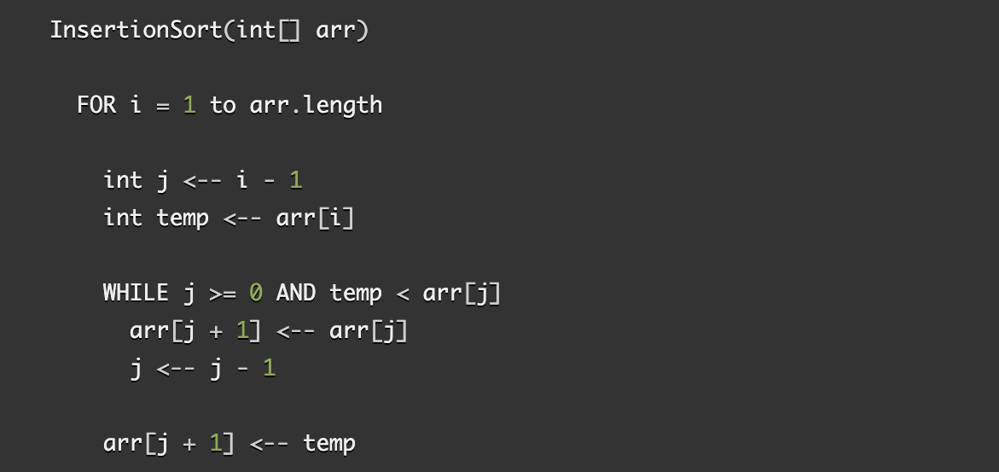
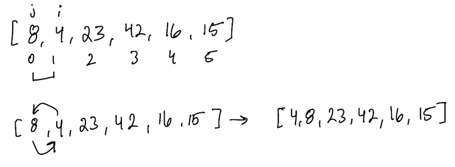
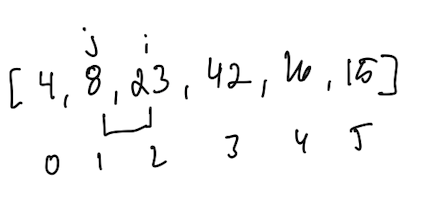
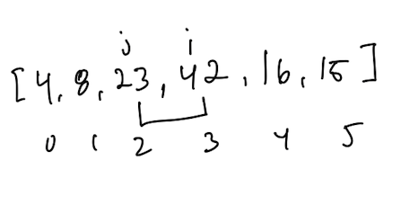
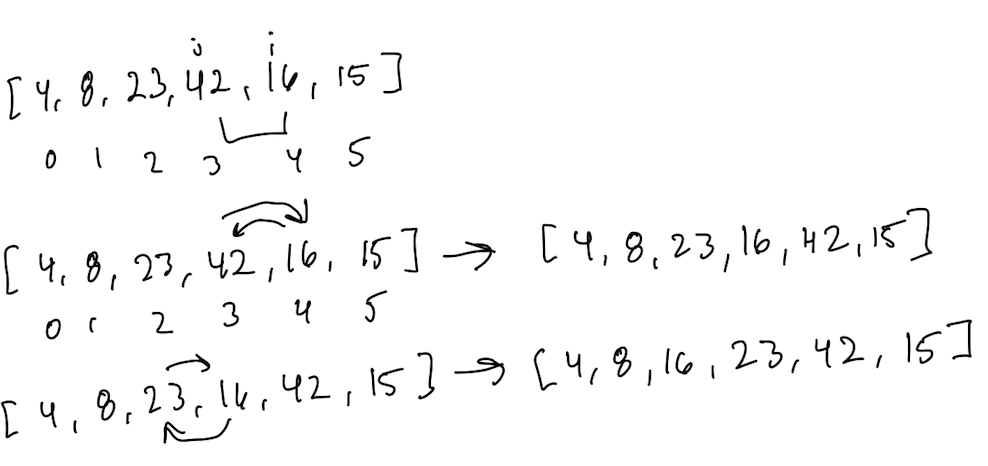
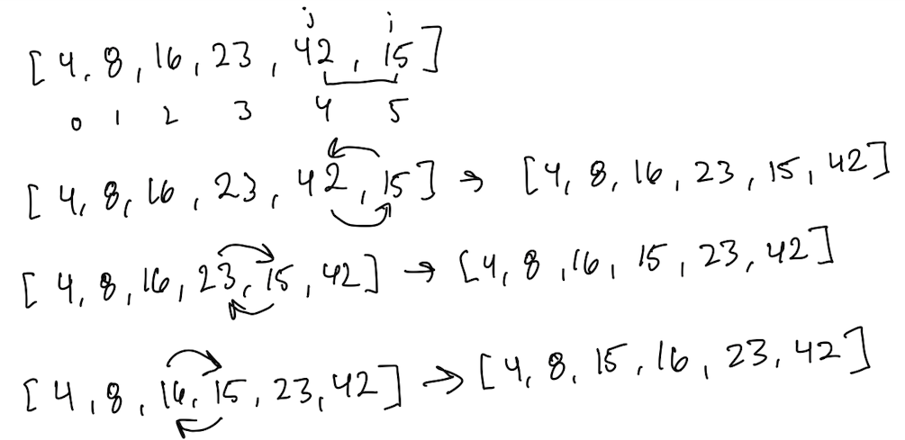

# Insertion Sort

### Pseudocode

#### Sample Array: `[8, 4, 23, 42, 16, 15]`

##### Pass 1

On the first pass of the for loop, i is assigned to index ‘1’ and j is assigned to ‘1 - i’ which is ‘0’ index within the array. This then enters the while loop; while j is >= 0 AND arr[j] > current.The while loop compares the values of index j and i. If j is greater than the current, it will swap spots.

##### Pass 2

On the second pass, j is not greater than I so it will remain in the same spot and increment to the next pair of indexes.

##### Pass 3

On the third pass, j is not greater than I so it will remain in the same spot and increment to the next pair of indexes.

##### Pass 4

On the fourth pass, it will enter the loop because 42 is greater than 16. Once 42 and 16 swap spots, it will re-enter the loop but will realize that 23 is greater than 16 and will swap its indexes.

##### Pass 5

On the fifth pass, this will do the same process as about but until 15 is swapped into its correct index position.

### Efficency
- O($n^{2}$)

### Resources
[Geeks For Geeks](https://www.geeksforgeeks.org/insertion-sort/)  
[getMaxed - Sorting Algorithms in JS : Insertion Sort](https://www.youtube.com/watch?v=0KQyyZatDgM)  
