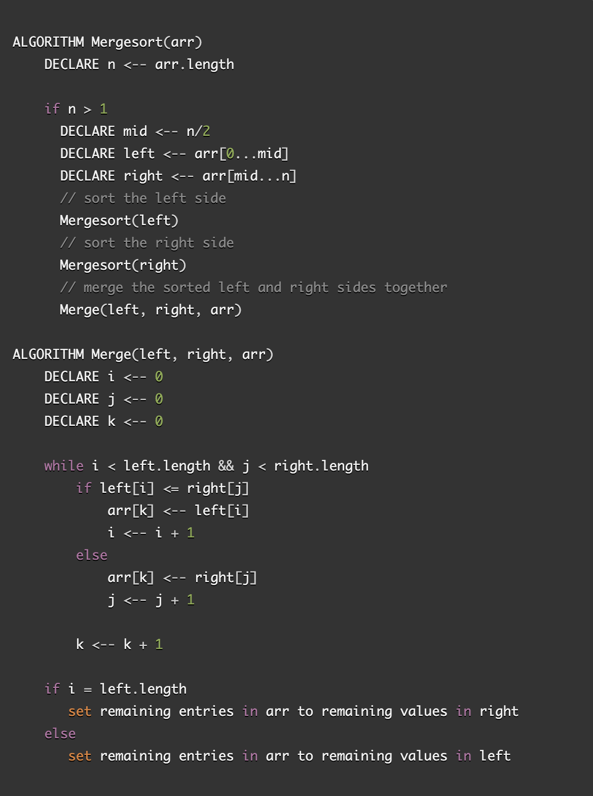

# Insertion Sort

### Pseudocode

### Sample Array: `[8, 4, 23, 42, 16, 15]`

### mergeSort() Process

***

What this function does is take in an array as an argument. We then declare a variable to track the length of the given array. We then declare a middle, left, and right. We declare the middle to know where to spit the left and right of the array.

### merge() Process

***

***

After we sort, we have a helper function that is called in `merge()` that is called within the last part of the `if` statement in `mergeSort()`. `merge()` takes in left, right, and arr. Once inside this method, it compares the values and assigns the values to the correct index position.

### Efficency

- O(nlog(n))

### Resources

- [Merge Sort in 3 minutes](https://www.youtube.com/watch?v=4VqmGXwpLqc)  
- [GeeksforGeeks - Merge Sort](https://www.geeksforgeeks.org/merge-sort/)
- [Javascript Freecodecamp Algorithm #34: Implement Merge Sort](https://www.youtube.com/watch?v=x_Z9FcAPmbk)
- [Slice - MDN](https://developer.mozilla.org/en-US/docs/Web/JavaScript/Reference/Global_Objects/Array/slice)  
